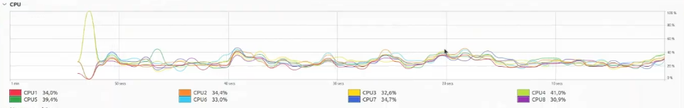

# Clase 10 - Scheduling avanzado

## CFS: Completely Fair Scheduler

El CFS es un algoritmo de planificación de procesos que se encarga de asignar la CPU a los procesos de manera justa. Para esto CFS sigue estos 3 principios:

- **Equidad:** No se asigna una cuota de tiempo fija a cada proceso, sino que se asigna una cuota de tiempo en función al peso de su prioridad.
- **Vitual runtime:** Cada proceso tiene un tiempo de ejecución virtual que se incrementa con cada tick del reloj. La prioridad de un proceso es inversamente proporcional a su virtual runtime.
- **Pesos por prioridad:** Cada proceso tiene una prioridad de niceness que se traduce en un peso (mapeado por una tabla harcodeada en el kernel) que se utiliza para calcular la cuota de tiempo que se le asigna a cada proceso. Esta prioridad va de -20 (mas favorable) a 19 (menos favorable). A medida que el niceness aumenta, el peso disminuye. Este peso a medida que disminuye, el virtual runtime aumenta más rapido, lo que hace que el proceso sea menos favorecido.

### Estructura del CFS

Para conseguir todo esto, el scheduler mantiene una estructura de datos llamada **red-black tree** que contiene los procesos en función de su virtual runtime. De esta manera, el proceso con menor virtual runtime es el que se ejecuta en cada momento con un quantum proporcinal a su peso. Este tipo de estructura de datos permite que la inserción y eliminación de procesos sea de complejidad logarítmica y el acceso al siguiente proceso sea de complejidad constante. Cada vez que un proceso se bloquea, se lo elimina de la red-black tree y cuando se desbloquea, se lo vuelve a insertar ajustando su virtual runtime de modo que no se vea penalizado por haber estado bloqueado.

Otra propiedad de CFS es que permite el balance de carga entre las múltiples CPUs de un sistema. Además permite multithreading ya que no trabaja ni con procesos ni con hilos, sino con tasks, que pueden ser procesos o hilos.

### Cáculo del virtual runtime

El cálculo del virtual runtime se hace de la siguiente manera:

$vruntime += \frac{\Delta exec}{weight} \times load\_weight$

Donde:

- $\Delta exec$ es el tiempo que ha estado ejecutándose el proceso desde la última vez que se actualizó su virtual runtime.
- $weight$ es el peso asociado a la prioridad del proceso.
- $load\_weight$ es un factor que se calcula en función de la carga del sistema en ese momento (según cuantos tasks haya en la red-black tree).

### Otras características

- **sched_latency** es el tiempo en el que el scheduler intenta ejecutar aunquesea una vez cada proceso. Por defecto esta latencia ronda los 48ms en un sistema con un número de tareas ejecutándose y se ajusta en función de la carga del sistema.
- **min_granularity** es el tiempo mínimo que un proceso puede estar ejecutándose antes de que el scheduler lo cambie por otro. Suele ser una fracción del **sched_latency**.
- **nice** es el valor que se le asigna a un proceso para que el scheduler lo trate de una manera u otra. A mayor valor, menos tiempo de CPU se le asigna. Este valor se puede modificar por el usuario con el comando `nice`.
