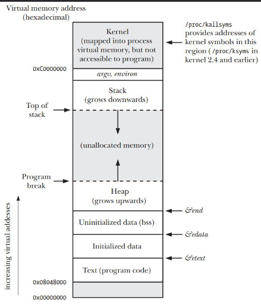
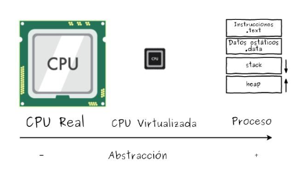
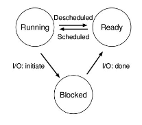

# Clase 5

## Programas

Un programa en UNIX en definitiva es un archivo binario que se puede ejecutar

## Compilacion

El proceso de compilación consta de 4 pasos:

1. Preprocesado
2. Compilación
3. Ensamblado
4. Linkado

### Preprocesado

Con los headers, se reemplazan los includes por el contenido de los archivos incluidos. Se eliminan los comentarios y se expanden las macros.

En C por ejemplo podemmos hacer gcc -E archivo.c para ver el archivo preprocesado (nuestro archivo + includes + macros)

### Compilación

Se traduce el código fuente a código ensamblador (archivo.s).

En C por ejemplo podemos hacer gcc -S archivo.c para ver el archivo ensamblador (nuestro archivo + includes + macros -> ensamblador). Podemos usar el flag -masm para especificar el dialecto de ensamblador.

### Ensamblado

Se traduce el código ensamblador a código binario (archivo.o). Se le llama objeto porque no es ejecutable, no tiene la dirección de memoria de las funciones por ende no se puede ejecutar.

En C por ejemplo podemos hacer gcc -c archivo.c para ver el archivo objeto (nuestro archivo + includes + macros -> ensamblador -> objeto).

### Linkado

Se unen los archivos objeto con las librerías necesarias para formar un archivo ejecutable. Se le llama ejecutable porque tiene la dirección de memoria de las funciones y se puede ejecutar. Un archivo ejecutable es un archivo del tipo ELF.

En C por ejemplo podemos hacer gcc archivo.c -o archivo para ver el archivo ejecutable (nuestro archivo + includes + macros -> ensamblador -> objeto -> ejecutable).

## De programa a proceso

El kernel se encarga de cargar las instrucciones y datos del programa en memoria, crearle un heap, un stack y otorgarle el control al programa siempre protegiendo al SO, a otros programas y a el mismo.

## Contenido de un proceso

Tiene los archivos abiertos, las señales pendientes, datos de kernel, estado del procesador, un espacio de direcciones de memora, uno o mas threads cada uno con un contador de progama, un stack, conjunto de registros y una sección de datos globales.

## Virtualización

### Virtualización de memoria

El Sistema Operativo le hace creer al proceso que tiene toda la memoria disponible y reservada para el. El proceso no sabe que la memoria es compartida.

Todos los procesos se dividen en:

- Text: Instucciones
- Data: Variables globales
- Heap: Memoria dinámica (alocable)
- Stack: Variables locales y el rastro de las llamadas a funciones

La virtualización de memoria le puede hacer creer a todos los procesos que tiene la dirección 0x0, pero en realidad no la tiene. El SO se encarga de mapear la dirección virtual a la dirección física.

Este mapeo se hace por hardware mediante la MMU (Memory Management Unit) que se encarga de traducir las direcciones virtuales a direcciones físicas.

### Virtualización de procesamiento

El SO le hace creer al proceso que tiene el procesador para el solo. El proceso no sabe que el procesador es compartido.

La idea es similar a la de la memoria, el SO se encarga de darle el control del procesador a un proceso y luego se lo quita para darselo a otro.

## Contexto de un proceso

Es toda la información necesaria para describir a un proceso.

- Address Space: Direcciones virtuales
- Estado del procesador: Registros
- Estrucutra de datos del kernel: Archivos abiertos, señales pendientes, etc

## Cambio de contexto (context switch)

Es el proceso de guardar el contexto de un proceso y cargar el contexto de otro proceso. Se hace para que el SO pueda darle el control a otro proceso.

Esta información se guarda en la PCB (Process Control Block) que es una estructura de datos que contiene toda la información necesaria para describir a un proceso.

## Estados de un proceso

### Corriendo (Running)

Solo hay un proceso corriendo en un procesador. Es aquel que ejecuta instrucciones y tiene el control del procesador.

### Listo (Ready)

Es aquel que esta en memoria y listo para ejecutarse a la espera de que el SO le de el control del procesador.

### Bloqueado (Blocked)

Es aquel que esta esperando por un evento para poder continuar. Por ejemplo, una lectura de disco.

## Pedido de memoria

Malloc es una lib call que le pide al SO un bloque de memoria mediante la syscall brk. El SO le da un bloque de memoria y le devuelve la dirección de memoria del bloque.
