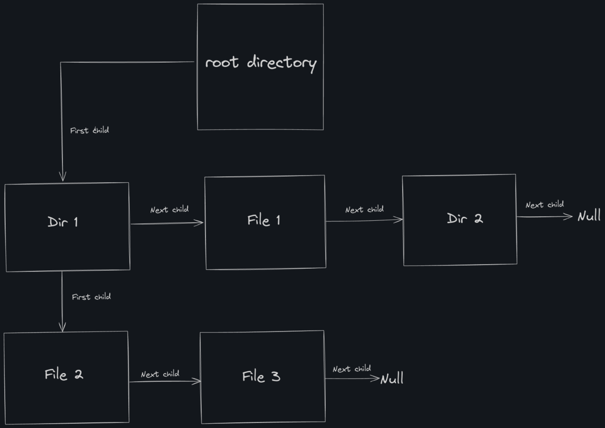

# fisop-fs


## Estructura de datos

Para la implementacion del sistema de archivos, se opto por utilizar una estructura enlazada para almacenar y gestionar los archivos y directorios. Esta decision se baso en la necesidad tener una estructura que nos permita una mayor flexibilidad al manipular los archivos y directorios de manera dinamica. 

El sistema de archivos se compone de una serie de nodos conectados que representan tanto directorios como archivos individuales. La estructura enlazada permite que cada directorio tenga un ‘primer hijo’, siendo este un archivo, y cada archivo o directorio tiene un ‘siguiente hijo’, formando así una lista enlazada que facilita la navegación y manipulación.




### Admin Filesystem

El struct `admin_filesystem_t` representa una abstraccion del sistema de archivos completo, proporcionando un marco organizativo y operativo que facilita la manipulación y gestión de todos los archivos y directorios. Este tipo de dato abstracto encapsula las operaciones esenciales disponibles en nuestro sistema de archivos y mantiene dos componentes fundamentales:

* fs_backup_file_path: Es un puntero que almacena la ruta del archivo de respaldo del sistema de archivos. Este archivo es utilizado para persistir la estructura y los datos del sistema de archivos.

* root_file: Es un puntero que apunta al nodo raíz del sistema de archivos. Este nodo raíz sirve como punto de entrada principal para acceder a todos los archivos y directorios almacenados en el sistema. Contiene la estructura inicial del sistema de archivos y permite la navegación y manipulación de los contenidos mediante enlaces a nodos hijos (first_child) y nodos hermanos (next_file).

```C
typedef struct {
	char *fs_backup_file_path;
	file_t *root_file;
} admin_filesystem_t;
```

### File

El struct `file_t` representa un nodo en la estructura enlazada. Como en los sistemas UNIX los directorios son considerados como archivos, se decidio englobar tanto un archivo como un directorio en este mismo struct. Cada nodo contiene la metadata del archivo o directorio, un puntero al primer hijo (en caso de ser un directorio), un puntero al siguiente archivo en el mismo nivel, y un buffer para los datos del archivo o directorio.

```C
typedef struct file_t {
	metadata_t metadata;        
	file_t *first_child;  // null if file is not directory     
	file_t *next_file;       
	char data[MAX_FILE_SIZE];   
} file_t;
```

### Metadata 
El struct `metadata_t` contiene informacion relevante sobre cada archivo o directorio, incluyendo su nombre, tamaño, tipo (archivo o directorio), y marcas de tiempo para la creacion, ultima edicion y ultimo acceso.

```C
typedef struct {
	char name[MAX_FILE_NAME_SIZE];   
	size_t id;                        
	time_t creation_timestamp;        
	time_t last_edit_timestamp;       
	time_t last_access_timestamp;     
	size_t size;                      
	bool is_directory;               
	size_t children_count;            
	mode_t mode;                      
} metadata_t;
```


## Acceso a Archivos y Directorios

El sistema de archivos utiliza una serie de funciones para navegar y manipular la estructura de directorios y archivos. Estas funciones permiten encontrar un archivo o directorio dado un path, insertar nuevos archivos o directorios, eliminar existentes, y actualizar sus metadatos, entre otros. 

### Navegación del Path

Para encontrar un archivo específico dado un path, se implementa una función que descompone el path en sus componentes individuales y recorre la estructura de lista enlazada desde la raíz (`root`). Esta función sigue los punteros `first_child` y `next_file` hasta encontrar el nodo correspondiente al archivo o directorio deseado.

### Insercion y Eliminacion

Para insertar un nuevo archivo o directorio, se utiliza una función que toma como parámetros el path del nuevo archivo y su metadata. La función navega hasta el directorio padre correspondiente y agrega el nuevo nodo en la lista enlazada de hijos del directorio. Para eliminar, se busca el nodo correspondiente y se ajustan los punteros de la lista enlazada para excluir el nodo eliminado.


## Serialización y deserialización del filesystem

Si en un momento determinado se debe persistir todo el filesystem a disco (ya sea porque se realiza un `flush` o si se desmonta el sistema de archivos), el admin_filesystem se encarga de guardarlo de la siguiente forma:

Dado un determinado árbol jerárquico de archivos en el filesystem, se guardan los metadatos (de archivos/directorios) y los datos (de archivos) siguiendo un recorrido "preorder" del mismo. Es decir, supongamos que se cuenta con los siguientes archivos/directorios:

```
/
├── home/
│   ├── checklist.txt
│   └── readme.md
├── etc/
│   └── main.c
├── bin/
└── countries.csv
```

Al momento de serializarlos, en el archivo de backup se guarda lo siguiente, en el orden indicado:

```
| --- Metadata de root (/) -------- |
| --- Metadata de home ------------ |
| --- Metadata de checklist.txt --- |
| --- Datos de checklist.txt ------ |
| --- Metadata de readme.md ------- |
| --- Datos de readme.md ---------- |
| --- Metadata de etc ------------- |
| --- Metadata de main.c ---------- |
| --- Datos de main.c ------------- |
| --- Metadata de bin ------------- |
| --- Metadata de countries.csv --- |
| --- Datos de countries.csv ------ |
```

donde la metadata corresponde a la información almacenada en el `struct metadata_t` (se guardan todos sus campos en ese mismo orden), mientras que los datos corresponden al buffer `data` del `struct file_t`.

Al momento de montar nuevamente el filesystem, el `admin_filesystem` se encarga de leer el archivo de backup con ese formato para reconstruir el filesystem en memoria.


