# TP N°2 - Scheduling y Cambio de Contexto

## Parte 1: Cambio de contexto

### De modo _kernel_ a modo _usuario_

> Utilizar GDB para visualizar el cambio de contexto. Realizar una captura donde se muestre claramente:
> - el cambio de contexto
> - el estado del stack al inicio de la llamada de `context_switch`
> - cómo cambia el stack instrucción a instrucción
> - cómo se modifican los registros luego de ejecutar `iret`

Antes de realizar el cambio de contexto, se llama a la función `env_run`, la cual
recibe un puntero al struct asociado al _environment_ que se desea correr
(`user_hello`). Debuggeando el kernel, podemos observar que contiene los siguientes valores:

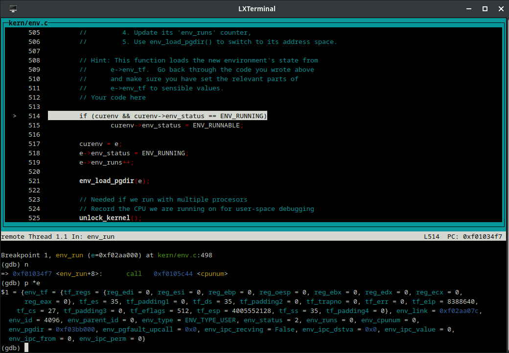

Obvsérvese los valores del campo `env_tf` (del tipo `struct Trapframe`). Este 
contiene los valores que deben tener los registros para poder hacer el cambio
de contexto y ejecutar el _environment_ en modo usuario.

El struct del _environment_ (`e`) se encuentra en la dirección de memoria 
`0xf02aa000`, tal como se puede apreciar en la siguiente imagen:

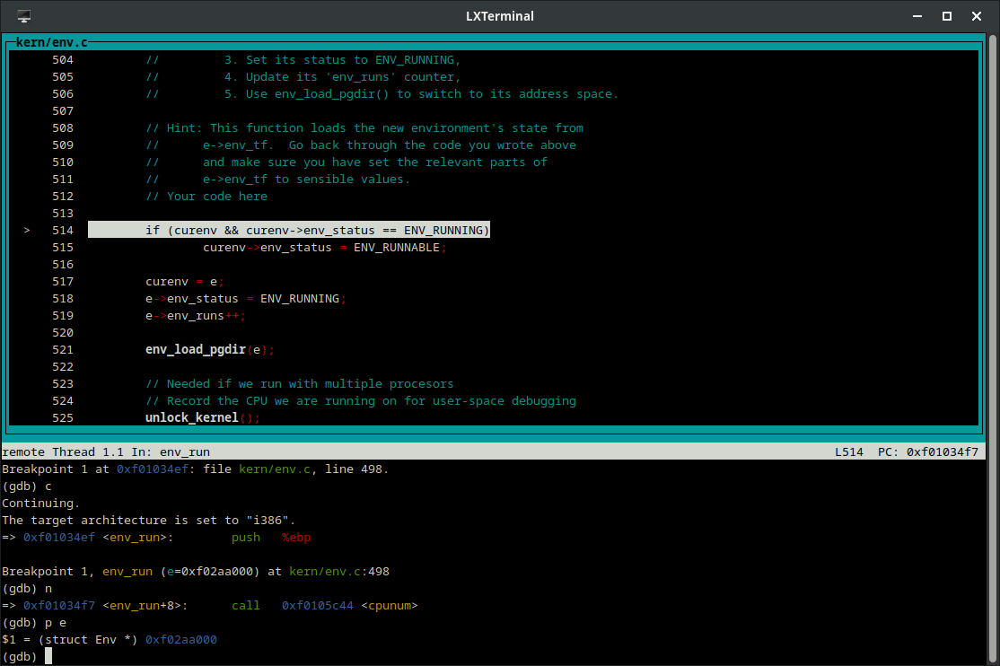

Una vez dentro de la subrutina `context_switch`, el contenido del stack es el siguiente:

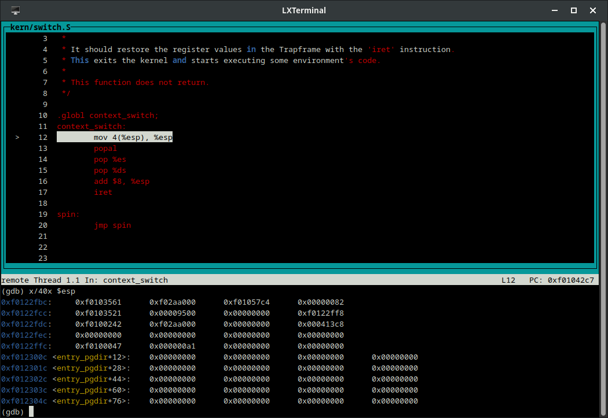

El valor que se encuentra en el tope del stack (`0xf0103561`) es la dirección 
de retorno para regresar de la subrutina. Esta dirección se pusheó al llamar a 
la subrutina. Los siguientes 4 bytes (`0xf02aa000`) corresponden a la ubicación
en memoria del `struct Trapframe` del _environment_ que deseamos ejecutar, tal 
como se mencionó previamente. Esta dirección se pusheó al stack ya que fue 
pasada como argumento cuando se llamó a la subrutina `context_switch`.

La primera instrucción de Assembly que ejecutamos es `mov 4(%esp), %esp`, la cual toma el valor contenido en la dirección `%esp + 4` y la copia al registro
del stack pointer (`%esp`). Es decir, estamos copiando la dirección del
`struct Env e` al `%esp`, con lo cual logramos que el tope del stack se
encuentre al principio del struct, para así poder acceder a sus campos.

Una vez ejecutada la primera instrucción, el stack queda de la siguiente forma:

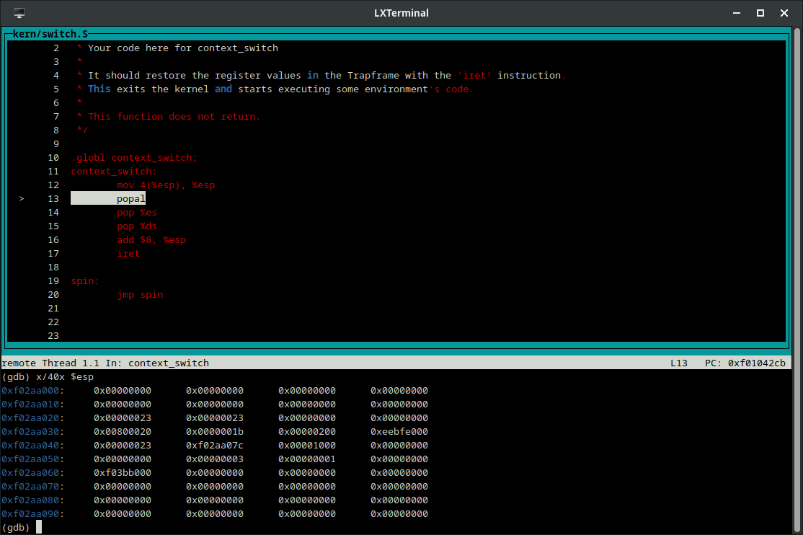

Podemos castear los valores en el tope del stack a un `struct Trapframe` para
observar mejor su contenido:

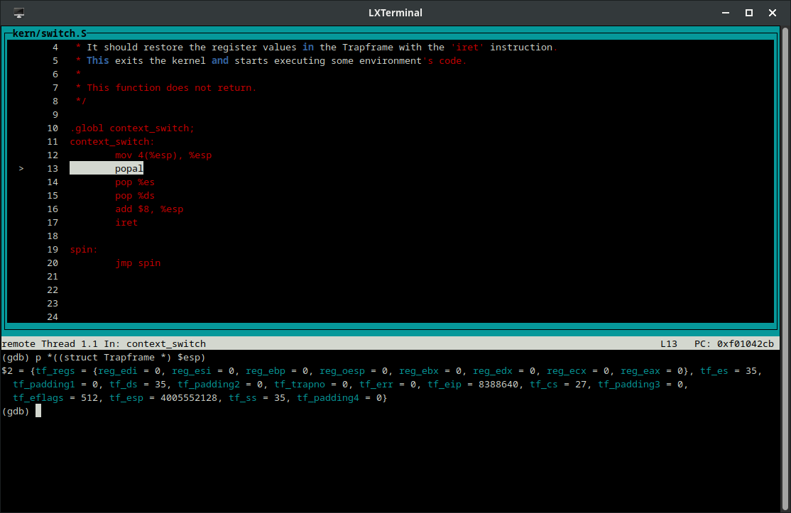

Como se puede ver, coincide con los valores de `e->env_tf` mostrado en la
primera imagen.

En este momento, los registros del procesador tienen valores correspondientes
a la ejecución del kernel:

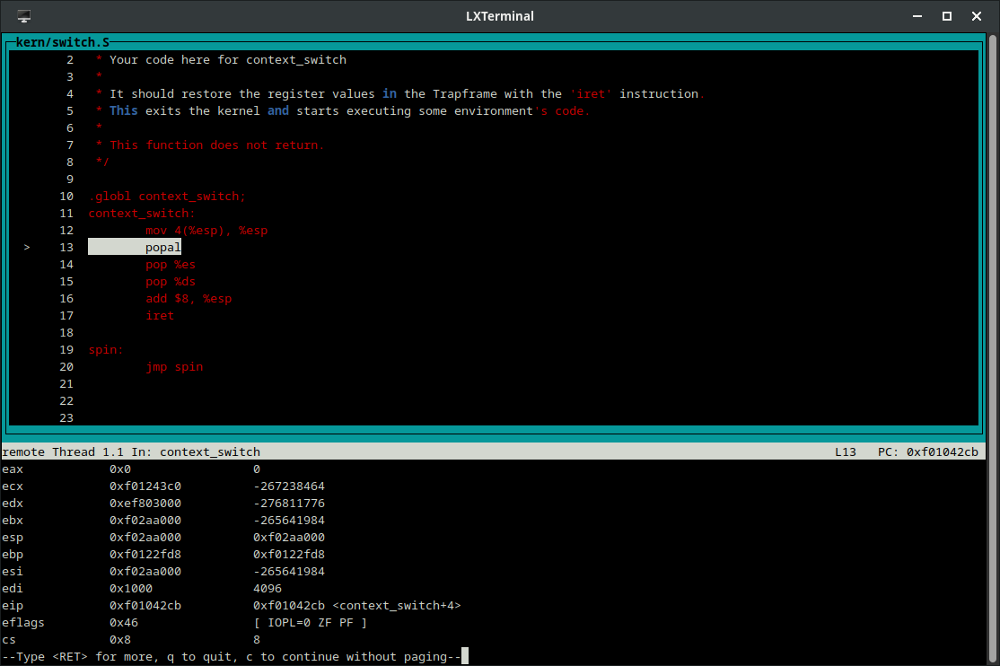

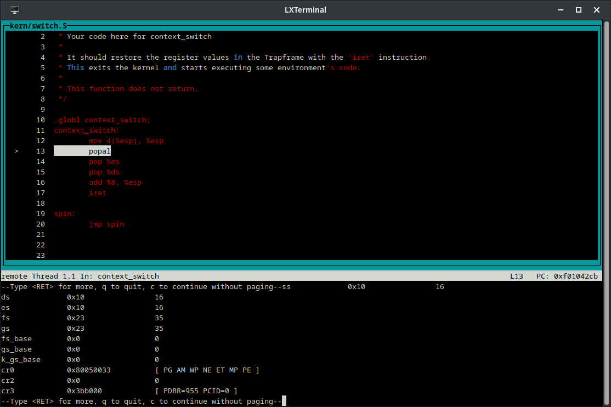

La siguiente instrucción (`popal`) popea múltiples valores del stack,
actualizando con ellos todos los registros de propósito general. Estos valores
se encuentran definidos en orden en el campo `e->env_tf.tf_regs`. Luego de esta instrucción, los registros quedan de la siguiente forma:

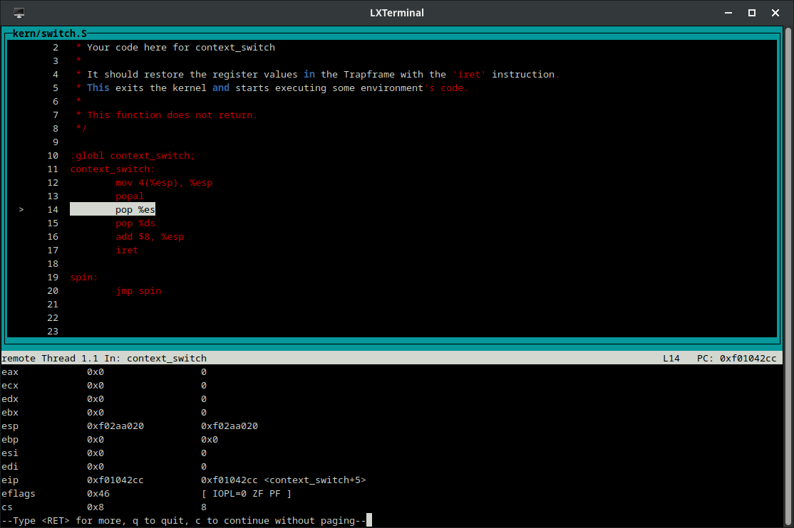

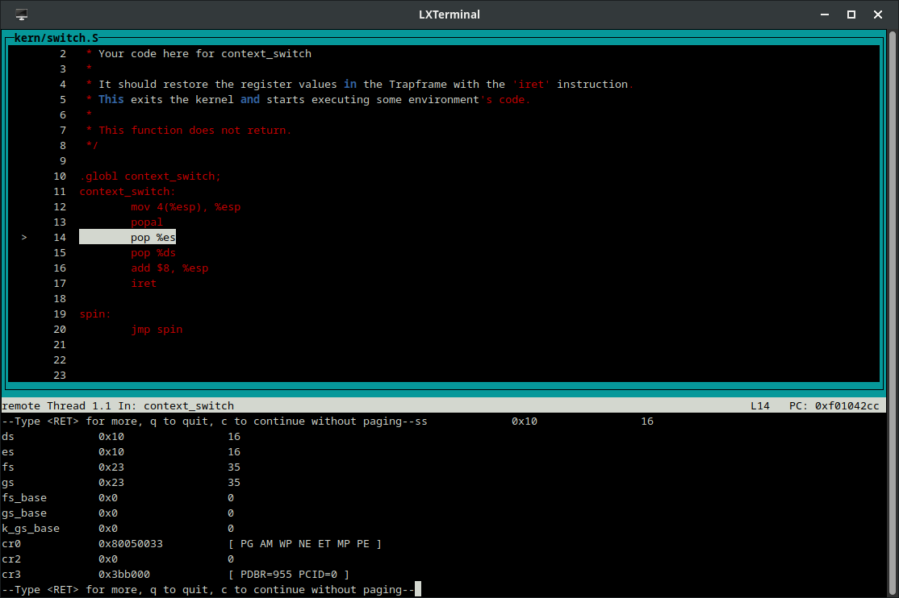

Obsérvese que los registros de propósito general se han actualizado.

Las siguientes dos instrucciones, `pop %es` y `pop %ds`, actualizan los valores
de los registros `%es` y `%ds` respectivamente con los dos valores del tope del
stack. Las siguientes dos imágenes muestran el contenido de estos dos registros
luego de cada una de las dos instrucciones:

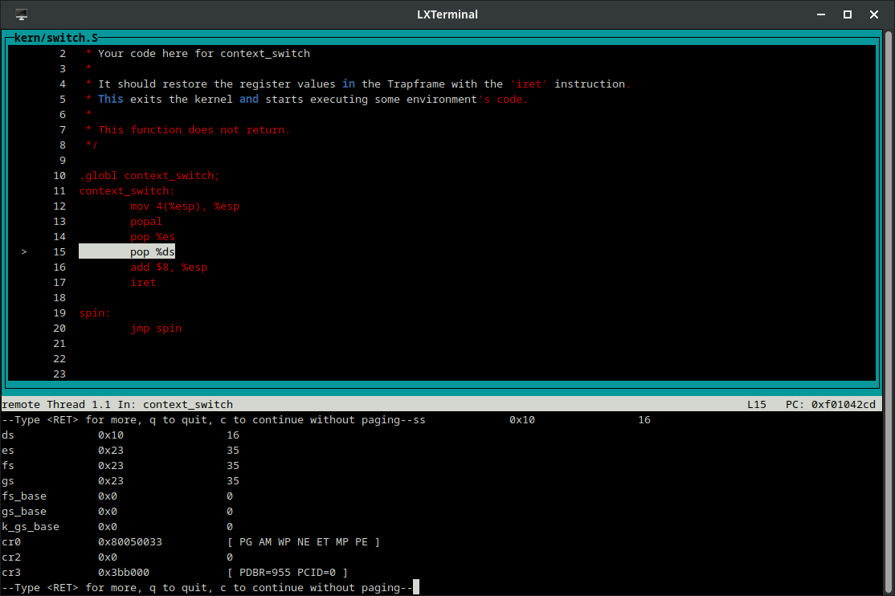

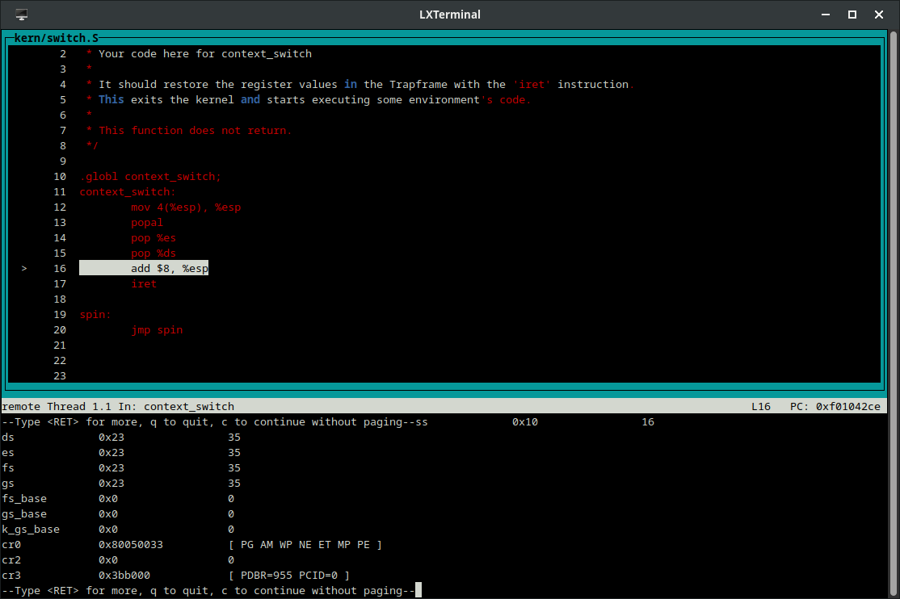

Lo siguiente en ejecutarse es `add $8, %esp`, lo cual suma 8 al valor del stack
pointer. Esto se hace para descartar los dos valores que se encuentran en el
top del stack en ese momento, correspondientes a los campos `tf_trapno` y `tf_err` del `struct Trapframe`. Estos dos valores se descartan ya que no son de
utilidad durante la realización del cambio de contexto.

Finalmente, se llega a la instrucción `iret`. El contenido de los registros en este momento es:

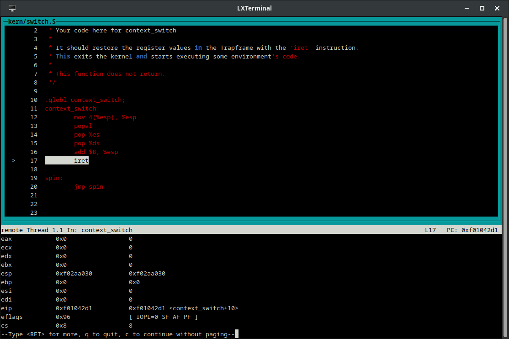

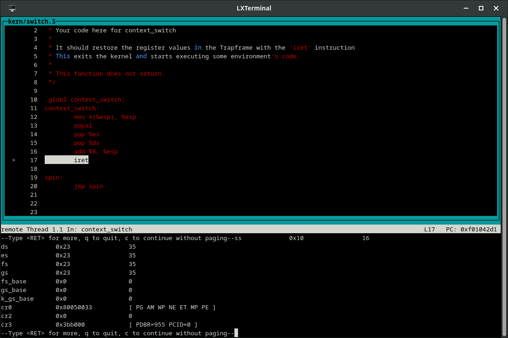

La instrucción `iret` se encarga de establecer los valores guardados de los 
registros `%eip`, `%cs`, `%eflags`, `%esp` y `%ss`, para pasar a la ejecución 
del _environment_ en modo usuario. Como consecuencia de haber modificado el 
instruction pointer, la siguiente instrucción a ejecutar será una instrucción
del _environment_ de usuario. En nuestro caso, la instrucción a ejecutar
corresponde al entry point del programa de usuario `user_hello`.

Una vez dentro del proceso de usuario, podemos ver que los registros poseen los
valores deseados:

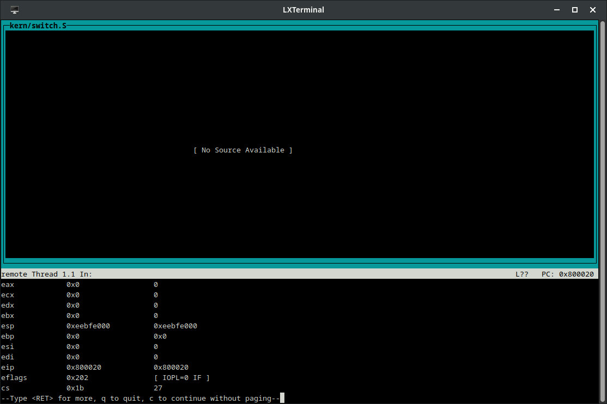

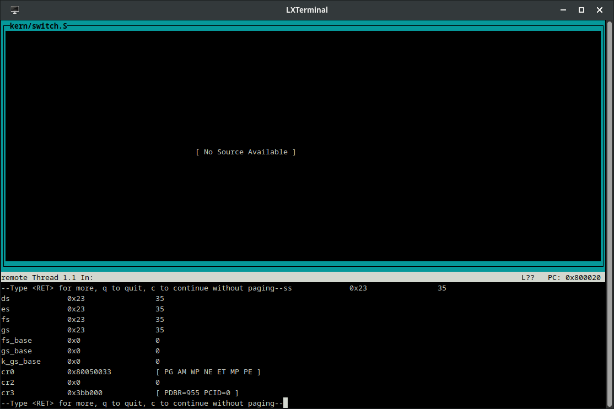

&nbsp;

### De modo _usuario_ a modo _kernel_

> Ejecutar el `kernel` con `qemu` y validar que las syscalls están funcionando.

Una vez implementada la subrutina `_alltraps`, el sistema puede hacer el cambio
de contexto de modo usuario a modo kernel correctamente. Las syscalls necesarias
para la ejecución del _environment_ `user_hello` (`sys_cputs` para imprimir
caracteres por salida estándar y `sys_env_destroy` para destruir el 
_environment_ una vez finalizado) funcionan perfectamente, por lo que el
_environment_ `user_hello` completa su ejecución correctamente:

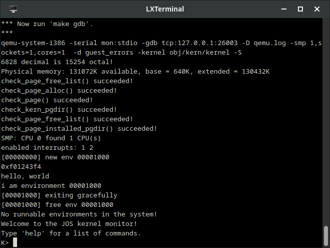


## Parte 3: Scheduler con prioridades

### Informe 

El algoritmo de scheduling programado propone un sistema prioridades para determinar qué proceso debe ejecutarse en cada momento. En la implementación propuesta, a cada uno de ellos se le asigna uno de los 8 niveles posibles de prioridad, siendo `0` la prioridad más baja y `7` la más alta. Los valores máximos y mínimos de prioridad son editables en tiempo de compilación, cambiando las constantes de configuración `MAX_PRIORITY` y `MIN_PRIORITY`.

Todos los procesos son inicializados con la prioridad más alta, y cualquier proceso creado a partir de un proceso padre (como sucede al hacer uso de la función fork), "hereda" su prioridad. 

Al inciar el sistema, se elige cualquier environment de los disponibles para correr y se ejecuta. Luego, cuando este proceso cede el control de los recursos o finaliza su timeslice y se manda una interrupción al procesador, reduce su prioridad en uno. Esta reducción de la prioridad de un environment ocurre cada vez que el sistema cambia de uno a otro, como método de regular las prioridades de cada environment y garantizar una división justa del tiempo de CPU para cada proceso. 

Al ocurrir este cambio de proceso, se debe tomar la decisión de qué proceso ejecutar después. En ese momento, el algoritmo elige aquel environment que tenga la mayor prioridad entre el actual (siempre y cuando exista y se encuentre en estado `RUNNING`) y el resto que tengan la etiqueta `RUNNABLE`. Si se encuentra un environment, se actualiza el historial de ejecuciones y se ejecuta. En caso de existir dos o más procesos con la misma prioridad, el algoritmo del scheduler se asegura de ejecutarlos con una política de Round Robin, es decir, nunca sucede que solo uno o dos environments se ejecutan constantemente, dejando al resto en condición de `starving`.

Esta serie de pasos se llevan a cabo sucesivamente hasta que no queden environments disponibles para ejecutar. Cuando sucede esto, el sistema se pone en estado inactivo o  `HALTED`, espera un tiempo determinado y al terminarse vuelve a buscar un proceso a ejecutar.  

Además, cuando la CPU realiza un número definido de operaciones, se lleva a cabo una tarea de `Boosting`. Esta acción consiste en elevar el valor de prioridad de todos los procesos de vuelta al nivel maximo. En la implementación propuesta, el número de operaciones que tienen que realizarse hasta llevar a cabo esta tarea es de `127` operaciones, pero el numero es configurable editando la constante: `BOOSTING_INTERVAL`. La idea de esto es prevenir la `"inanición"` o condición de `starving`, que hace referencia a cuando un proceso no puede avanzar o completar su ejecución debido a otros procesos en el sistema teniendo siempre o casi siempre una prioridad más alta. El enfoque elegido asegura que los procesos con alta prioridad se ejecuten con preferencia, pero también permite que los environments de menor prioridad eventualmente tengan su turno.

### Tests de prioridades

Se implementaron 5 tests para verificar que el scheduler de prioridades funcione correctamente


* **priority_test_1**: Este test se diseñó para verificar cómo el scheduler de prioridades maneja un environment con una prioridad inicial alta que disminuye con cada iteración de `sys_yield()`. Como resultado de correr el test, se logra ver la correcta disminución de la prioridad del environment, el cual inicia con una prioridad máxima de 7 y va disminuyendo hasta llegar a la prioridad 0, mínima prioridad posible, para luego finalizar el ciclo. Adicionalmente, se testea el correcto funcionamiento de la syscall `sys_get_env_priority()`, la cual obtiene la prioridad actual de un proceso especificado según su id.

```
[00000000] new env 00001000
0xf0228db8
Hello, I am environment 00001000, cpu 0
My priority is: 7
Back in environment 00001000, iteration 0, cpu 0
My priority is: 6
Back in environment 00001000, iteration 1, cpu 0
My priority is: 5
Back in environment 00001000, iteration 2, cpu 0
My priority is: 4
Back in environment 00001000, iteration 3, cpu 0
My priority is: 3
Back in environment 00001000, iteration 4, cpu 0
My priority is: 2
Back in environment 00001000, iteration 5, cpu 0
My priority is: 1
Back in environment 00001000, iteration 6, cpu 0
My priority is: 0
Back in environment 00001000, iteration 7, cpu 0
My priority is: 0
Back in environment 00001000, iteration 8, cpu 0
My priority is: 0
Back in environment 00001000, iteration 9, cpu 0
My priority is: 0
All done in environment 00001000, cpu 0
[00001000] exiting gracefully
[00001000] free env 00001000
```

* **priority_test_2**: El objetivo del test es verificar que el schdeduler de prioridades maneje correctamente el caso de un environment que se ejecuta múltiples veces, disminuyendo su prioridad de más alta a más baja, y que a su vez, se realice un boost de prioridad para evitar una condición de `starving` del environment en un hipotético escenario con más environments. La salida de este test muestra efectivamente que el boost se realiza correctamente y de forma periódica:

```
[00000000] new env 00001000
0xf02306dc
Hello, I am environment 00001000, cpu 0
My priority is: 7
Back in environment 00001000, iteration 0, cpu 0
My priority is: 6
Back in environment 00001000, iteration 1, cpu 0
My priority is: 5
Back in environment 00001000, iteration 2, cpu 0
My priority is: 4
Back in environment 00001000, iteration 3, cpu 0
My priority is: 3
Back in environment 00001000, iteration 4, cpu 0
My priority is: 2
Back in environment 00001000, iteration 5, cpu 0
My priority is: 1
Environment 00001000 ran 120 times on cpu 0 with priority 0

Back in environment 00001000, iteration 126, cpu 0
My priority is: 7
Back in environment 00001000, iteration 127, cpu 0
My priority is: 5
Back in environment 00001000, iteration 128, cpu 0
My priority is: 4
Back in environment 00001000, iteration 129, cpu 0
My priority is: 3
Back in environment 00001000, iteration 130, cpu 0
My priority is: 2
Back in environment 00001000, iteration 131, cpu 0
My priority is: 1
Environment 00001000 ran 120 times on cpu 0 with priority 0

Back in environment 00001000, iteration 252, cpu 0
My priority is: 7
Back in environment 00001000, iteration 253, cpu 0
My priority is: 6
Back in environment 00001000, iteration 254, cpu 0
My priority is: 4
Back in environment 00001000, iteration 255, cpu 0
My priority is: 3
Back in environment 00001000, iteration 256, cpu 0
My priority is: 2
Back in environment 00001000, iteration 257, cpu 0
My priority is: 1
Environment 00001000 ran 120 times on cpu 0 with priority 0

Back in environment 00001000, iteration 378, cpu 0
My priority is: 7
Back in environment 00001000, iteration 379, cpu 0
My priority is: 6
Back in environment 00001000, iteration 380, cpu 0
My priority is: 5
Back in environment 00001000, iteration 381, cpu 0
My priority is: 4
Back in environment 00001000, iteration 382, cpu 0
My priority is: 3
Back in environment 00001000, iteration 383, cpu 0
My priority is: 2
All done in environment 00001000, cpu 0
[00001000] exiting gracefully
[00001000] free env 00001000
```

* **priority_test_3**: El objetivo del test consiste en verificar la capacidad de un environment de cambiar su prioridad a una prioridad menor, haciendo uso de la syscall `sys_set_env_priority`, y que a su vez se imposibilite al environment el aumento de su prioridad. Para ello se tiene un environment con la prioridad inicial mas alta, y se setea a una prioridad menor verificando la prioridad actual con la syscall `sys_get_env_priority`. Pero cuando se intenta cambiar de nuevo a la prioridad mas alta, con las misma syscall, se produce un error:

```
[00000000] new env 00001000
0xf0238000
Hello, I am environment 00001000, cpu 0
My priority is: 7
Now I will change my priority to 4:
My priority is: 4
But it fails when I try to increase my priority back to 7:
[00001000] user panic in <unknown> at lib/syscall.c:30: syscall 14 returned 1 (> 0)
```

* **priority_test_4**: El objetivo de este ejemplo consiste en probar el comportamiento del scheduler cuando un environment crea un environment hijo mediante `fork()`. Al crear un environment hijo, este hereda la prioridad del padre. Tanto el padre como el hijo van alternando la ejecución usando `sys_yield()` en un ciclo, y cada uno imprime su prioridad en cada iteracion, comprobando asi la correcta disminución de prioridad de ambos envrionments, y la alternancia entre ambos. Como ambos procesos siempre tienen la misma prioridad, se ejecutan en Round Robin:

```
[00000000] new env 00001000
0xf023f924
[00001000] new env 00001001
I am the parent environment 00001000, cpu 0
My priority is: 7
I am the child environment 00001001, cpu 0
(child) My priority is: 7
Back in parent environment 00001000, iteration 0, cpu 0, priority 6
Back in child environment 00001001, iteration 0, cpu 0, priority 6
Back in parent environment 00001000, iteration 1, cpu 0, priority 5
Back in child environment 00001001, iteration 1, cpu 0, priority 5
Back in parent environment 00001000, iteration 2, cpu 0, priority 4
Back in child environment 00001001, iteration 2, cpu 0, priority 4
Back in parent environment 00001000, iteration 3, cpu 0, priority 3
Back in parent environment 00001000, iteration 4, cpu 0, priority 2
Back in child environment 00001001, iteration 3, cpu 0, priority 2
Back in parent environment 00001000, iteration 5, cpu 0, priority 1
Back in child environment 00001001, iteration 4, cpu 0, priority 1
Back in parent environment 00001000, iteration 6, cpu 0, priority 0
Back in child environment 00001001, iteration 5, cpu 0, priority 0
Back in parent environment 00001000, iteration 7, cpu 0, priority 0
Back in child environment 00001001, iteration 6, cpu 0, priority 0
Back in parent environment 00001000, iteration 8, cpu 0, priority 0
Back in child environment 00001001, iteration 7, cpu 0, priority 0
Back in parent environment 00001000, iteration 9, cpu 0, priority 0
Back in child environment 00001001, iteration 8, cpu 0, priority 0
Back in parent environment 00001000, iteration 10, cpu 0, priority 0
Back in child environment 00001001, iteration 9, cpu 0, priority 0
Back in parent environment 00001000, iteration 11, cpu 0, priority 0
Back in child environment 00001001, iteration 10, cpu 0, priority 0
Back in parent environment 00001000, iteration 12, cpu 0, priority 0
Back in child environment 00001001, iteration 11, cpu 0, priority 0
Back in parent environment 00001000, iteration 13, cpu 0, priority 0
Back in child environment 00001001, iteration 12, cpu 0, priority 0
Back in parent environment 00001000, iteration 14, cpu 0, priority 0
[00001000] exiting gracefully
[00001000] free env 00001000
Back in child environment 00001001, iteration 13, cpu 0, priority 0
Back in child environment 00001001, iteration 14, cpu 0, priority 0
[00001001] exiting gracefully
[00001001] free env 00001001
```

* **priority_test_5**: El objetivo del test es comprobar el comportamiento del scheduler con dos environments padre e hijo, con la particularidad que el proceso hijo inmediatamente luego del `fork()` disminuye su prioridad a la mínima posible. Como el hijo ya no tiene la misma prioridad que el padre, este seguirá ejecutandose hasta llegar a la minima prioridad, evitando asi una alternancia entre los environments como en el test anterior:

```
[00000000] new env 00001000
0xf0248348
[00001000] new env 00001001
I am the parent environment 00001000, cpu 0
My priority is: 7
I am the child environment 00001001, cpu 0
(child) My priority is: 7
I will set my priority to 0
Back in parent environment 00001000, cpu 0, priority 6
Back in parent environment 00001000, cpu 0, priority 5
Back in parent environment 00001000, cpu 0, priority 4
Back in parent environment 00001000, cpu 0, priority 3
Back in parent environment 00001000, cpu 0, priority 2
Back in parent environment 00001000, cpu 0, priority 1
Back in child environment 00001001, cpu 0, priority 0
[00001001] exiting gracefully
[00001001] free env 00001001
Back in parent environment 00001000, cpu 0, priority 0
[00001000] exiting gracefully
[00001000] free env 00001000
```


